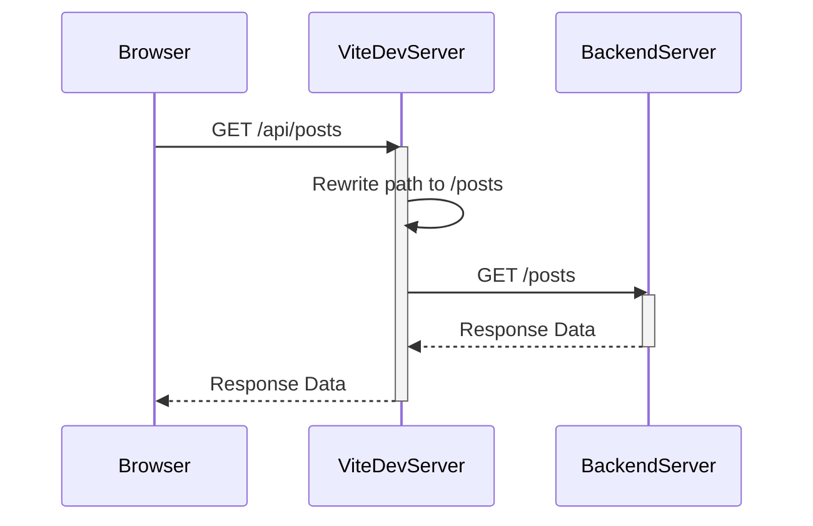
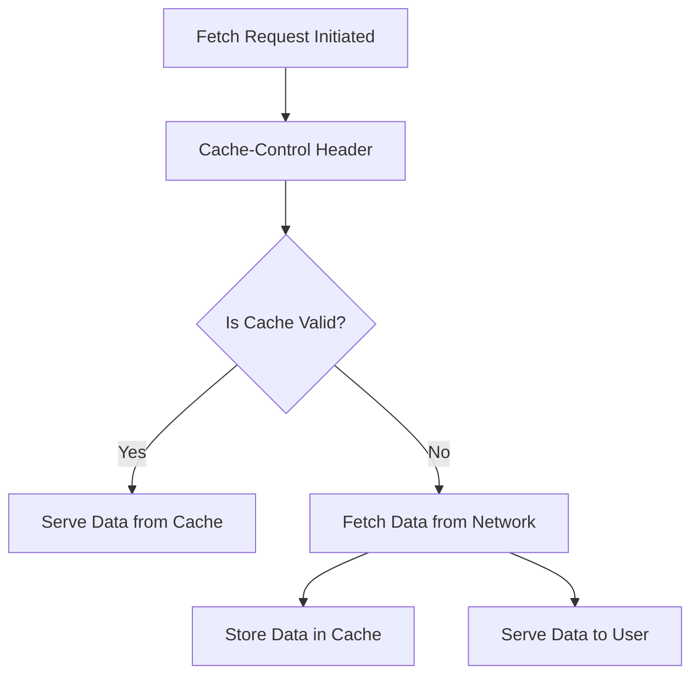
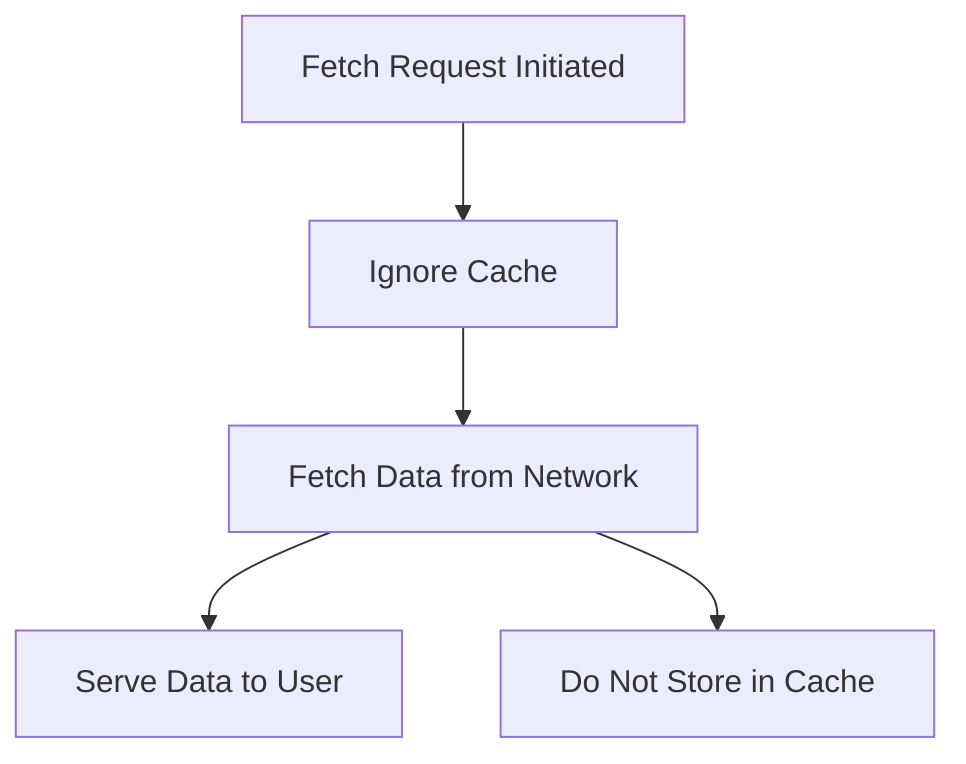
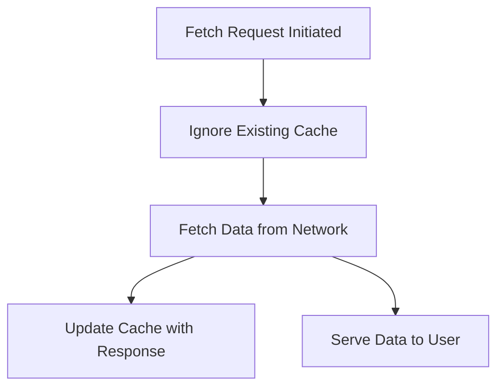
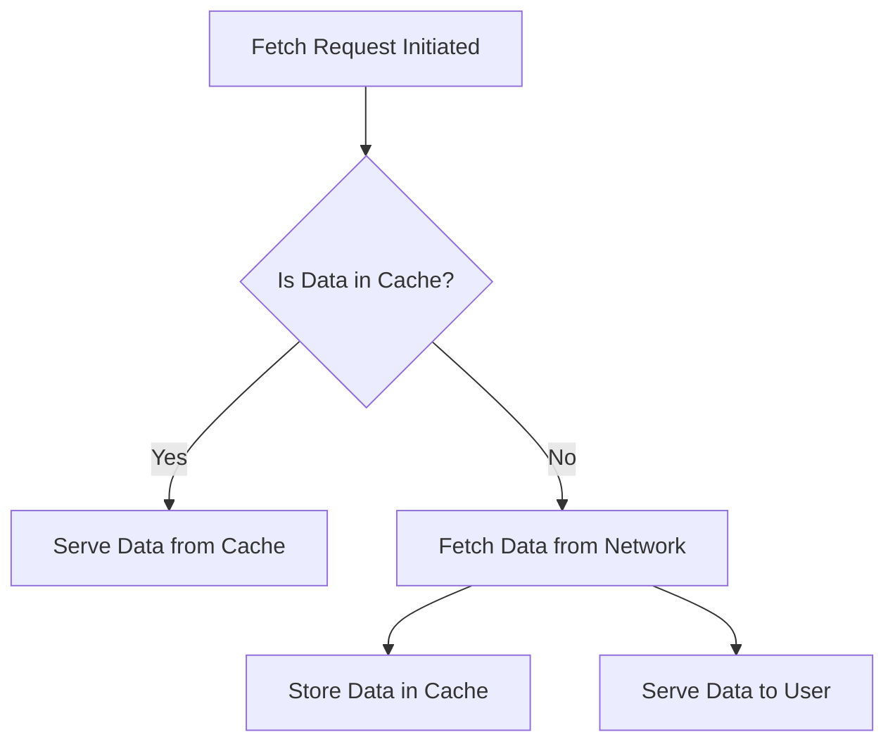
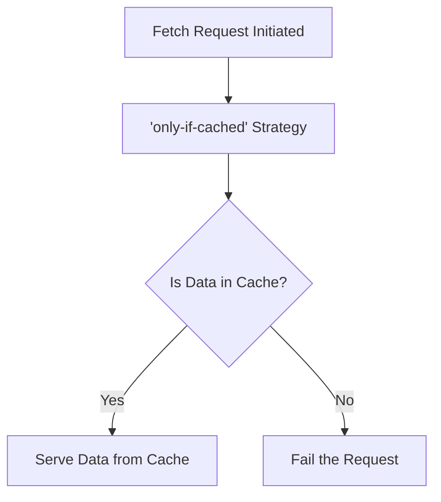

# JS Fetch document

## How to run

- install package

```bash
npm install
```

- automatic creating the mock data

```bash
npm run generate
```

- start the application

```bash
npm run start
```

## Notes

### only-if-cached

Works only under certain conditions

- Requests must be of the same origin
- The mode option must be set to 'same-origin'. The default 'cors' will not work.

#### Vite configuration

Modified to use vite's default proxy settings to represent the same origin



#### App.tsx ... fetchData

changed default mode of fetch from 'cors' to 'same-origin' if only-if-cached

```tsx
if (cacheStrategy === "only-if-cached") {
  requestInit.mode = "same-origin";
}
```

## Workflow

### Default



### No-store



### Reload



### Force-cache



### Only-if-cached


