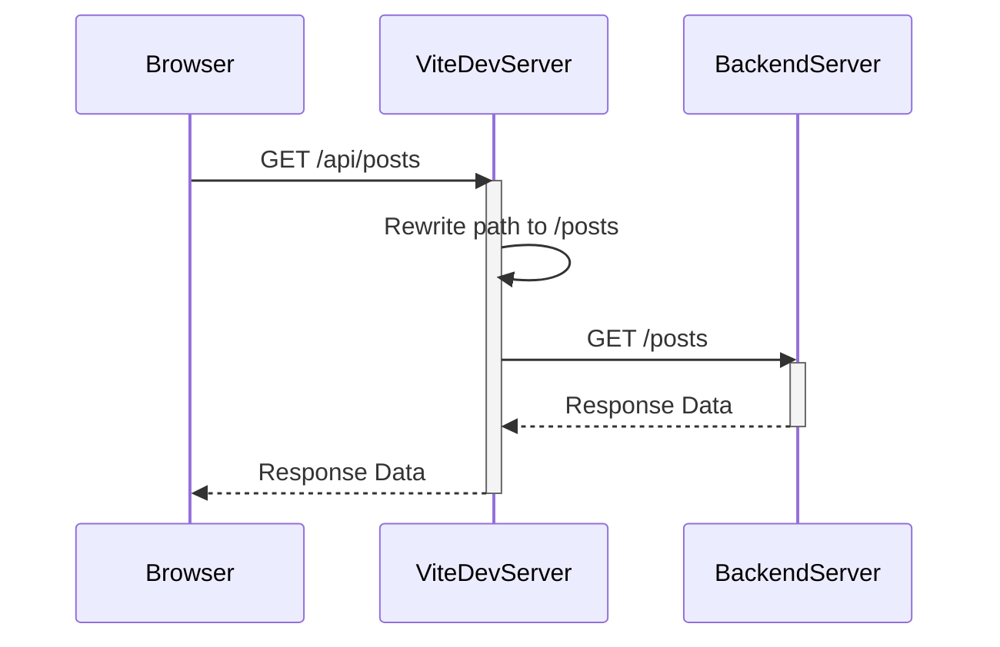

# JS Fetch document

## Notes

### only-if-cached

Works only under certain conditions

- Requests must be of the same origin

#### Vite configuration

Modified to use vite's default proxy settings to represent the same origin



- The mode option must be set to 'same-origin'. The default 'cors' will not work.

#### App.tsx ... fetchData

changed default mode of fetch from 'cors' to 'same-origin' if only-if-cached

```tsx
if (cacheStrategy === 'only-if-cached') {
  requestInit.mode = 'same-origin';
}
```

## How to run

1. install package

```bash
npm install
```

2. automatic creating the mock data

```bash
cd mock-server && node generateData.js
```

3. start up docker for json server

```bash
cd mock-server && docker componse up -d
```
